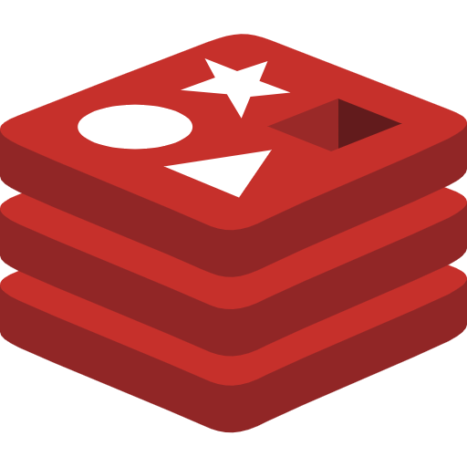
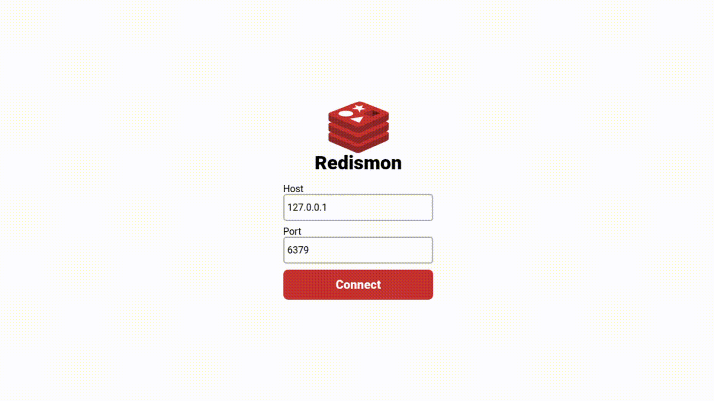
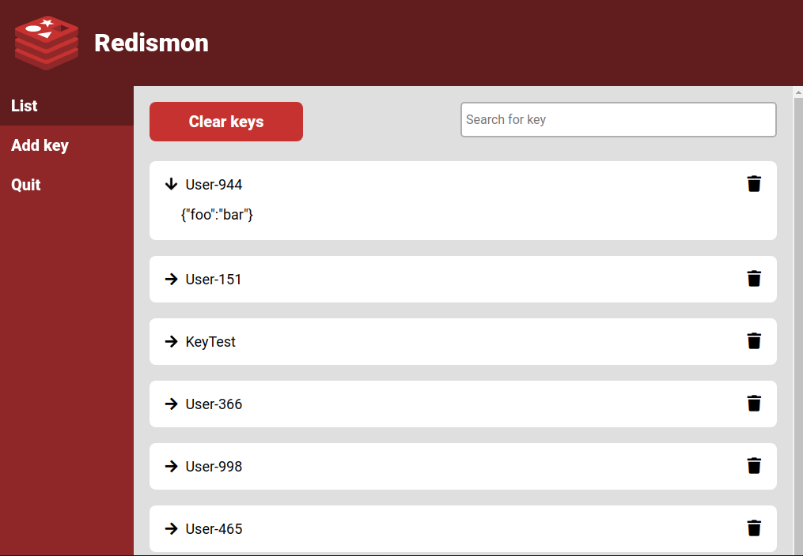
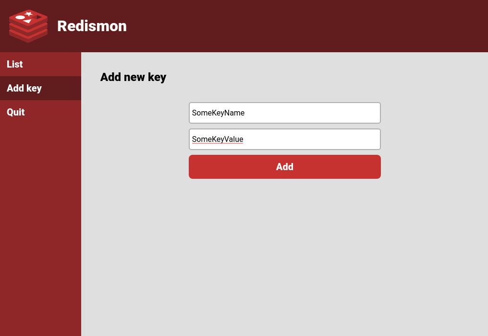

<br />
<p align="center">

  <a href="https://github.com/othneildrew/Best-README-Template">
    
  </a>

  <h3 align="center">Redismon</h3>

  <p align="center">
    A simple and fast Graphical User Interface for Redis
  </p>
  
</p>

## About The Project

<p align="center">
    
</p>

Redismon is a GUI for Redis Database, where you can visualize, add and search for keys.

### Built With

* [ElectronJS](https://www.electronjs.org/)
* [Node Redis](https://www.npmjs.com/package/redis)

<!-- GETTING STARTED -->
## Getting Started

This is an example of how you may give instructions on setting up your project locally.
To get a local copy up and running follow these simple example steps.

### Prerequisites

To use Redismon, you need to have <a href='https://nodejs.org/en/'>NodeJS</a>

### Installation

1. Clone the repository
   ```sh
   git clone https://github.com/mhbarros/redismon
   ```
3. Enter the folder and install NPM packages
   ```sh
   cd redismon
   npm install
   ```
4. Start Redismon
   ```sh
   npm start
   ```

<!-- CONTACT -->
## Contact

Marcelo Barros - mhbarros99@gmail.com

##  Screenshots



